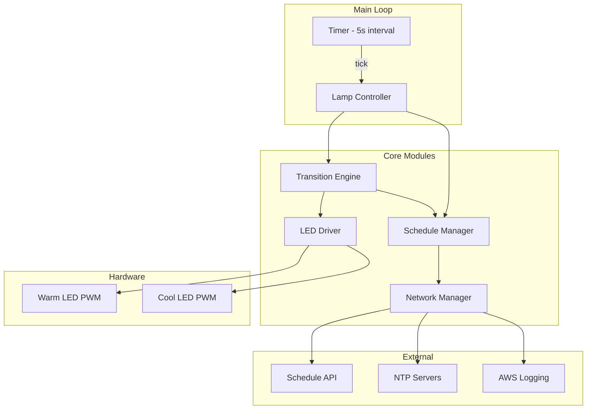
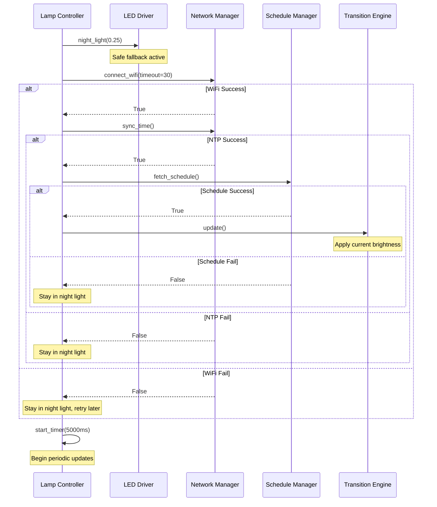
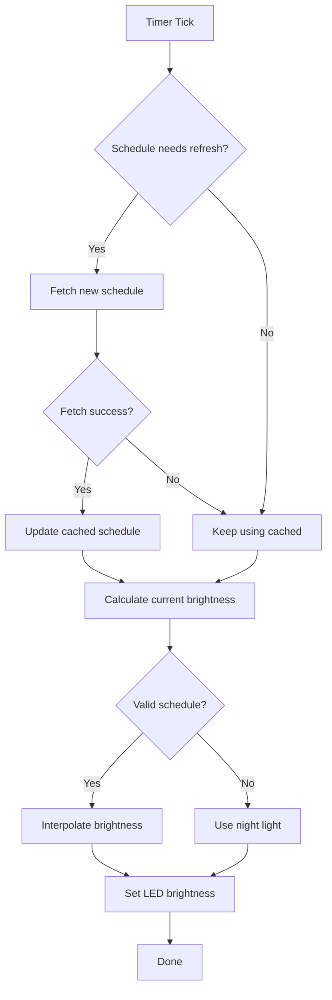

# Design Document

## Overview

This design refactors the Sunrise Lamp Controller from a monolithic single-file architecture to a modular system with clear separation of concerns. The refactored system addresses three critical issues: network timeout errors, brightness state tracking causing sudden jumps, and unreliable startup behavior.

The architecture follows an event-driven model where a periodic timer drives brightness updates from a cached schedule, while network operations happen asynchronously and infrequently.

## Architecture



### Data Flow

1. **Startup**: Lamp_Controller initializes LED_Driver (night light), then Network_Manager connects WiFi and syncs NTP
2. **Schedule Fetch**: Schedule_Manager requests schedule via Network_Manager, parses and caches it
3. **Timer Tick**: Every 5 seconds, Lamp_Controller asks Transition_Engine for current brightness target
4. **Brightness Calculation**: Transition_Engine reads schedule from Schedule_Manager, interpolates based on current time
5. **LED Update**: Transition_Engine calls LED_Driver to set brightness (with gamma correction)

## Components and Interfaces

### MicroPython Compatibility Notes

The design uses these MicroPython-compatible patterns:

- **Classes**: Fully supported, use single underscore `_` prefix for "private" attributes (convention only)
- **Type hints in signatures**: Supported syntactically but ignored at runtime; use for documentation only
- **TypedDict**: NOT available in MicroPython runtime; use plain dicts with documented structure
- **time functions**: `time.time()`, `time.localtime()`, `time.mktime()` available; rp2 port uses Unix epoch (1970)
- **Return tuples**: Use plain tuples `(a, b)`, avoid `tuple[float, float]` syntax in actual code

**Note**: Type hints shown in the design are for documentation clarity. The actual implementation will omit type annotations or use them only in comments for IDE support.

### LED_Driver (`led_driver.py`)

Encapsulates PWM control and brightness state tracking.

```python
class LEDDriver:
    """Controls warm and cool LED channels with brightness state tracking."""

    def __init__(self, warm_pin: int, cool_pin: int, pwm_freq: int = 8000):
        """Initialize PWM channels and brightness state."""

    def set_brightness(self, warm: float, cool: float) -> None:
        """Set perceived brightness (0.0-1.0) for both channels.

        Updates internal state, applies gamma correction, sets PWM.
        """

    def get_brightness(self) -> tuple[float, float]:
        """Return current (warm, cool) perceived brightness from internal state."""

    def night_light(self, brightness: float = 0.25) -> None:
        """Set night light mode (warm only at specified brightness)."""

    def off(self) -> None:
        """Turn off both channels."""
```

**Internal State:**

- `_warm_brightness: float` - Current perceived warm brightness (0.0-1.0)
- `_cool_brightness: float` - Current perceived cool brightness (0.0-1.0)
- `_warm_pwm: machine.PWM` - Warm channel PWM object
- `_cool_pwm: machine.PWM` - Cool channel PWM object

**Gamma Correction:**

```python
def _to_duty_cycle(self, brightness: float) -> int:
    """Convert perceived brightness to PWM duty cycle."""
    return round(65535 * (brightness ** 2.2))
```

### Network_Manager (`network_manager.py`)

Handles WiFi, NTP sync, and HTTP operations with retry logic.

```python
class NetworkManager:
    """Manages network connectivity with retry and fallback logic."""

    def __init__(self, ssid: str, password: str, ntp_servers: list[str] = None):
        """Initialize with WiFi credentials and NTP server list."""

    def connect_wifi(self, timeout: int = 30) -> bool:
        """Connect to WiFi with timeout. Returns success status."""

    def is_connected(self) -> bool:
        """Check if WiFi is currently connected."""

    def sync_time(self) -> bool:
        """Sync RTC via NTP, trying multiple servers. Returns success status."""

    def http_get(self, url: str, headers: dict = None, timeout: int = 10) -> dict | None:
        """GET request with retry logic. Returns JSON or None on failure."""

    def http_post(self, url: str, data: dict, headers: dict = None, timeout: int = 10) -> bool:
        """POST request with retry logic. Returns success status."""
```

**Retry Logic:**

- 3 attempts with exponential backoff (1s, 2s, 4s delays)
- Socket timeout of 5 seconds per attempt
- NTP tries each server in sequence before failing

**NTP Implementation:**
Uses raw socket with timeout instead of flaky `ntptime.settime()`:

```python
def _ntp_request(self, host: str) -> int | None:
    """Request time from NTP server. Returns unix timestamp or None."""
    NTP_DELTA = 2208988800
    NTP_QUERY = bytearray(48)
    NTP_QUERY[0] = 0x1B

    try:
        addr = socket.getaddrinfo(host, 123)[0][-1]
        s = socket.socket(socket.AF_INET, socket.SOCK_DGRAM)
        s.settimeout(5)
        s.sendto(NTP_QUERY, addr)
        msg = s.recv(48)
        s.close()
        val = struct.unpack("!I", msg[40:44])[0]
        return val - NTP_DELTA
    except:
        return None
```

### Schedule_Manager (`schedule_manager.py`)

Fetches, validates, caches, and provides schedule data.

```python
class ScheduleManager:
    """Manages schedule fetching, caching, and timestamp computation."""

    def __init__(self, network: NetworkManager, api_url: str, api_token: str):
        """Initialize with network manager and API configuration."""

    def fetch_schedule(self) -> bool:
        """Fetch new schedule from server. Returns success status."""

    def needs_refresh(self) -> bool:
        """Check if schedule should be refreshed (no schedule, expired, or stale)."""

    def get_entries(self) -> list[ScheduleEntry]:
        """Return cached schedule entries sorted by time."""

    def get_mode(self) -> str:
        """Return current schedule mode ('dayNight', 'scheduled', 'demo')."""

    def has_valid_schedule(self) -> bool:
        """Check if a valid cached schedule exists."""
```

**Schedule Entry Type:**

```python
class ScheduleEntry(TypedDict):
    unix_time: int      # Computed locally from time + timezone
    warm: float         # 0.0-1.0 (converted from 0-100)
    cool: float         # 0.0-1.0 (converted from 0-100)
    label: str          # Optional label (e.g., "sunrise", "bedtime")
```

**Server Response Format:**

```json
{
  "mode": "dayNight",
  "utc_offset": -18000,
  "server_time": 1703894400,
  "entries": [
    { "time": "06:30", "warm": 20, "cool": 0, "label": "civil_twilight_begin" },
    { "time": "07:00", "warm": 80, "cool": 30, "label": "sunrise" },
    { "time": "17:30", "warm": 80, "cool": 30, "label": "sunset" },
    { "time": "18:00", "warm": 40, "cool": 0, "label": "civil_twilight_end" },
    { "time": "21:00", "warm": 25, "cool": 0, "label": "bedtime" },
    { "time": "22:00", "warm": 10, "cool": 0, "label": "night" }
  ]
}
```

**Timestamp Computation:**

```python
def _compute_timestamps(self, entries: list, utc_offset: int) -> list[ScheduleEntry]:
    """Convert time strings to unix timestamps using current date and offset."""
    now = time.time()
    today = time.localtime(now)

    result = []
    for entry in entries:
        h, m = entry["time"].split(":")
        # Create timestamp for today at this time (UTC)
        local_time = time.mktime((today[0], today[1], today[2], int(h), int(m), 0, 0, 0))
        # Adjust for timezone (NTP gives UTC, we need to match local times)
        unix_time = local_time - utc_offset

        result.append({
            "unix_time": unix_time,
            "warm": entry["warm"] / 100.0,
            "cool": entry["cool"] / 100.0,
            "label": entry.get("label", "")
        })

    return sorted(result, key=lambda x: x["unix_time"])
```

### Transition_Engine (`transition_engine.py`)

Calculates current brightness based on schedule and time.

```python
class TransitionEngine:
    """Calculates brightness targets based on schedule position."""

    def __init__(self, schedule: ScheduleManager, leds: LEDDriver):
        """Initialize with schedule manager and LED driver."""

    def update(self) -> None:
        """Calculate and apply current brightness based on time and schedule."""

    def get_current_target(self) -> tuple[float, float]:
        """Return (warm, cool) brightness target for current time."""
```

**Interpolation Algorithm:**

```python
def get_current_target(self) -> tuple[float, float]:
    """Calculate brightness target based on current position in schedule."""
    entries = self._schedule.get_entries()
    if not entries:
        return (0.25, 0.0)  # Night light fallback

    now = time.time()

    # Find surrounding entries
    prev_entry = None
    next_entry = None

    for i, entry in enumerate(entries):
        if entry["unix_time"] > now:
            next_entry = entry
            prev_entry = entries[i - 1] if i > 0 else None
            break
    else:
        # Past all entries - use last entry's brightness
        return (entries[-1]["warm"], entries[-1]["cool"])

    if prev_entry is None:
        # Before first entry - use first entry's brightness
        return (next_entry["warm"], next_entry["cool"])

    # Linear interpolation between prev and next
    duration = next_entry["unix_time"] - prev_entry["unix_time"]
    elapsed = now - prev_entry["unix_time"]
    progress = elapsed / duration

    warm = prev_entry["warm"] + (next_entry["warm"] - prev_entry["warm"]) * progress
    cool = prev_entry["cool"] + (next_entry["cool"] - prev_entry["cool"]) * progress

    return (warm, cool)
```

### Lamp_Controller (`main.py`)

Main orchestrator that initializes components and runs the timer loop.

```python
class LampController:
    """Main controller orchestrating all components."""

    def __init__(self, config):
        """Initialize all components from configuration."""

    def start(self) -> None:
        """Start the lamp controller (blocking)."""

    def _on_timer(self, timer) -> None:
        """Timer callback - update brightness and check schedule."""

    def _startup_sequence(self) -> None:
        """Execute startup: night light -> WiFi -> NTP -> schedule."""
```

## Data Models

### Configuration (`config.py`)

```python
# Network
WIFI_SSID: str = "network_name"
WIFI_PASSWORD: str = "password"
NTP_SERVERS: list[str] = ["pool.ntp.org", "time.google.com", "time.cloudflare.com"]

# Hardware
WARM_LED_PIN: int = 10
COOL_LED_PIN: int = 20
PWM_FREQUENCY: int = 8000

# Timing
UPDATE_INTERVAL_MS: int = 5000      # LED update timer (5 seconds)
SCHEDULE_REFRESH_HOURS: int = 6     # How often to fetch new schedule
WIFI_TIMEOUT_S: int = 30            # WiFi connection timeout
HTTP_TIMEOUT_S: int = 10            # HTTP request timeout
NTP_TIMEOUT_S: int = 5              # NTP request timeout

# Defaults
NIGHT_LIGHT_BRIGHTNESS: float = 0.25

# API
SCHEDULE_API_URL: str = "https://api.example.com/lights"
SCHEDULE_API_TOKEN: str = "secret"
LOGGING_API_URL: str = "https://api.example.com/logging"
LOGGING_API_TOKEN: str = "secret"
CLIENT_NAME: str = "Sunrise Lamp"
```

### Internal State

```python
# LED Driver State
_warm_brightness: float  # 0.0-1.0, perceived brightness
_cool_brightness: float  # 0.0-1.0, perceived brightness

# Schedule Manager State
_cached_schedule: list[ScheduleEntry]  # Sorted by unix_time
_utc_offset: int                       # Seconds from UTC
_last_fetch_time: int                  # Unix timestamp of last successful fetch
_mode: str                             # 'dayNight', 'scheduled', 'demo'

# Network Manager State
_wlan: network.WLAN                    # WiFi interface
_time_synced: bool                     # Whether NTP sync succeeded

# Lamp Controller State
_timer: machine.Timer                  # Periodic update timer
_startup_complete: bool                # Whether startup sequence finished
```

## Startup Sequence



## Timer Tick Flow



## Correctness Properties

_A property is a characteristic or behavior that should hold true across all valid executions of a system—essentially, a formal statement about what the system should do. Properties serve as the bridge between human-readable specifications and machine-verifiable correctness guarantees._

### Property 1: Brightness State Round-Trip

_For any_ perceived brightness value (warm, cool) in the range [0.0, 1.0], setting the LED brightness and then getting the brightness should return the same values.

```python
# For all warm in [0.0, 1.0], cool in [0.0, 1.0]:
led.set_brightness(warm, cool)
result = led.get_brightness()
assert result == (warm, cool)
```

**Validates: Requirements 2.1, 2.5**

### Property 2: Gamma Correction Formula

_For any_ perceived brightness value in the range [0.0, 1.0], the computed PWM duty cycle should equal `round(65535 * brightness^2.2)`.

```python
# For all brightness in [0.0, 1.0]:
duty = led._to_duty_cycle(brightness)
expected = round(65535 * (brightness ** 2.2))
assert duty == expected
```

**Validates: Requirements 2.7**

### Property 3: Linear Interpolation Correctness

_For any_ start brightness, end brightness, and progress value in [0.0, 1.0], the interpolated brightness should equal `start + (end - start) * progress`.

```python
# For all start in [0.0, 1.0], end in [0.0, 1.0], progress in [0.0, 1.0]:
result = interpolate(start, end, progress)
expected = start + (end - start) * progress
assert abs(result - expected) < 0.0001  # Float tolerance
```

**Validates: Requirements 2.6**

### Property 4: Brightness Equals Entry at Entry Time

_For any_ schedule with entries and any time T exactly equal to an entry's unix_time, the calculated target brightness should equal that entry's brightness values exactly.

```python
# For all schedules with entries, for all entries E in schedule:
engine.set_time(E.unix_time)
warm, cool = engine.get_current_target()
assert warm == E.warm
assert cool == E.cool
```

**Validates: Requirements 4.1**

### Property 5: Skip to Most Recent Past Entry

_For any_ schedule and any time T that is past multiple entries but before the next entry, the starting brightness for interpolation should be the most recent past entry's brightness.

```python
# For all schedules, for all times T where entries[i].time < T < entries[i+1].time:
# The interpolation should start from entries[i]
engine.set_time(T)
warm, cool = engine.get_current_target()
# Brightness should be between entries[i] and entries[i+1]
assert entries[i].warm <= warm <= entries[i+1].warm or entries[i].warm >= warm >= entries[i+1].warm
```

**Validates: Requirements 4.4**

### Property 6: Schedule Entries Sorted Chronologically

_For any_ valid schedule returned by Schedule_Manager, the entries should be sorted in ascending order by unix_time.

```python
# For all valid schedules:
entries = schedule_manager.get_entries()
for i in range(len(entries) - 1):
    assert entries[i].unix_time <= entries[i + 1].unix_time
```

**Validates: Requirements 4.5, 7.4**

### Property 7: Timestamp Computation with Timezone

_For any_ time string "HH:MM" and UTC offset, the computed unix timestamp should represent that local time correctly. Converting back should yield the original time.

```python
# For all time_str in valid "HH:MM" format, offset in valid range:
unix_time = compute_timestamp(time_str, offset)
# The local time at unix_time should match the input
local = time.localtime(unix_time + offset)
assert f"{local[3]:02d}:{local[4]:02d}" == time_str
```

**Validates: Requirements 7.2, 8.2**

### Property 8: Brightness Validation Range

_For any_ brightness value outside the range [0, 100], the Schedule_Manager should reject it during validation.

```python
# For all brightness < 0 or brightness > 100:
entry = {"time": "12:00", "warm": brightness, "cool": 50}
assert schedule_manager.validate_entry(entry) == False
```

**Validates: Requirements 7.6**

### Property 9: Network Retry with Exponential Backoff

_For any_ network operation that fails, the Network_Manager should retry up to 3 times with delays of approximately 1s, 2s, 4s between attempts.

```python
# For all failing network operations:
# Measure time between retry attempts
# attempt 1 -> wait ~1s -> attempt 2 -> wait ~2s -> attempt 3 -> wait ~4s -> fail
delays = measure_retry_delays(failing_operation)
assert len(delays) == 3
assert 0.8 < delays[0] < 1.2  # ~1 second
assert 1.6 < delays[1] < 2.4  # ~2 seconds
assert 3.2 < delays[2] < 4.8  # ~4 seconds
```

**Validates: Requirements 1.1**

### Property 10: Return Failure After Max Retries

_For any_ network operation that fails all retry attempts, the function should return a failure status (False or None) without raising an exception.

```python
# For all operations that fail 3+ times:
result = network_manager.http_get(failing_url)
assert result is None  # Returns None, doesn't raise
```

**Validates: Requirements 1.2**

### Property 11: Try All NTP Servers Before Failing

_For any_ NTP sync attempt where servers fail, all configured servers should be tried before reporting failure.

```python
# For all NTP server lists of length N where all servers fail:
servers_tried = []
result = network_manager.sync_time()  # With mock that tracks calls
assert result == False
assert len(servers_tried) == N  # All servers were attempted
```

**Validates: Requirements 1.4**

### Property 12: Schedule Refresh Conditions

_For any_ state of the Schedule_Manager, `needs_refresh()` should return True if and only if: (a) no schedule exists, (b) current time exceeds last entry by >1 hour, or (c) refresh interval elapsed.

```python
# For all schedule states:
# Case (a): No schedule
schedule_manager._cached_schedule = None
assert schedule_manager.needs_refresh() == True

# Case (b): Past last entry by >1 hour
schedule_manager._cached_schedule = [{"unix_time": now - 3700}]
assert schedule_manager.needs_refresh() == True

# Case (c): Refresh interval elapsed
schedule_manager._last_fetch_time = now - (6 * 3600 + 1)
assert schedule_manager.needs_refresh() == True

# Negative case: Valid schedule, recent fetch
schedule_manager._cached_schedule = [{"unix_time": now + 3600}]
schedule_manager._last_fetch_time = now - 3600
assert schedule_manager.needs_refresh() == False
```

**Validates: Requirements 9.5**

## Error Handling

### Network Errors

| Error                   | Handling                                                         |
| ----------------------- | ---------------------------------------------------------------- |
| WiFi connection timeout | Log warning, stay in night light, retry every 60s                |
| WiFi disconnection      | Continue with cached schedule, attempt reconnect on next refresh |
| NTP timeout             | Try next server in list, fall back to night light if all fail    |
| HTTP timeout            | Retry with exponential backoff (1s, 2s, 4s)                      |
| HTTP 4xx/5xx            | Log error, use cached schedule                                   |
| JSON parse error        | Log error, use cached schedule                                   |

### Schedule Errors

| Error                              | Handling                        |
| ---------------------------------- | ------------------------------- |
| Invalid brightness (outside 0-100) | Reject entry, log warning       |
| Invalid time format                | Reject entry, log warning       |
| Empty schedule                     | Fall back to night light mode   |
| Missing timezone offset            | Default to UTC (0), log warning |

### Hardware Errors

| Error                        | Handling                                      |
| ---------------------------- | --------------------------------------------- |
| PWM initialization failure   | Log error, halt (cannot operate without LEDs) |
| Timer initialization failure | Log error, fall back to blocking loop         |

## Testing Strategy

### Unit Tests

Unit tests verify specific examples and edge cases:

1. **LED_Driver**

   - Initialization sets correct PWM frequency
   - `night_light()` sets warm to 0.25, cool to 0
   - `off()` sets both channels to 0
   - Boundary values (0.0, 1.0) work correctly

2. **Network_Manager**

   - WiFi connection with valid credentials
   - HTTP GET returns parsed JSON
   - HTTP POST sends correct payload

3. **Schedule_Manager**

   - Parse valid server response
   - Reject invalid brightness values
   - Handle missing optional fields

4. **Transition_Engine**
   - Before first entry returns first entry's brightness
   - After last entry returns last entry's brightness
   - Exactly at entry time returns entry's brightness

### Property-Based Tests

Property-based tests verify universal properties across many generated inputs. Use the `hypothesis` library (or MicroPython equivalent) with minimum 100 iterations per property.

Each property test must be tagged with:

```python
# Feature: lamp-controller-refactor, Property N: [property description]
```

**Test Configuration:**

- Minimum 100 iterations per property
- Use constrained generators for valid input ranges
- Test edge cases: 0.0, 1.0, boundary times

### Integration Tests

Integration tests verify component interactions:

1. **Startup sequence** - Verify night light → WiFi → NTP → schedule flow
2. **Timer tick** - Verify brightness updates correctly over time
3. **Schedule refresh** - Verify new schedule replaces old correctly
4. **Error recovery** - Verify fallback to night light on failures

### Test Environment

Since MicroPython on Pico W has limited testing support:

1. **Desktop testing**: Run core logic (interpolation, gamma, parsing) on desktop Python with pytest/hypothesis
2. **Hardware testing**: Manual verification of PWM output, network operations
3. **Mock hardware**: Create mock classes for `machine.PWM`, `network.WLAN` for desktop testing
